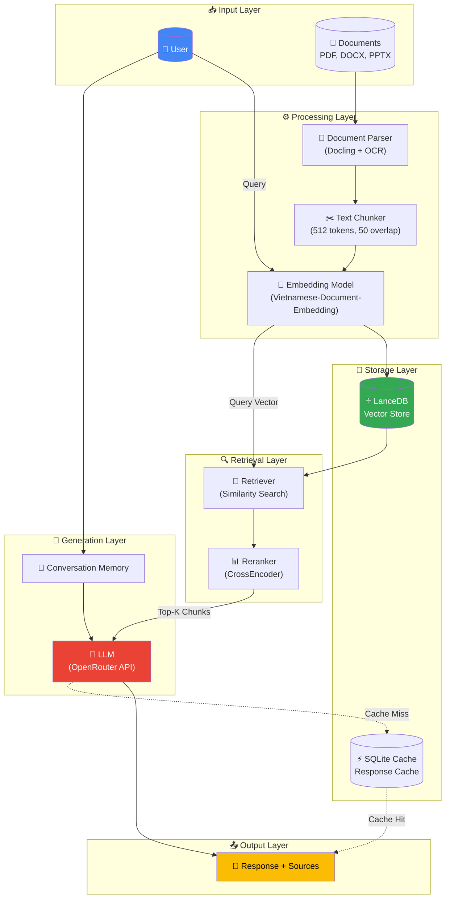
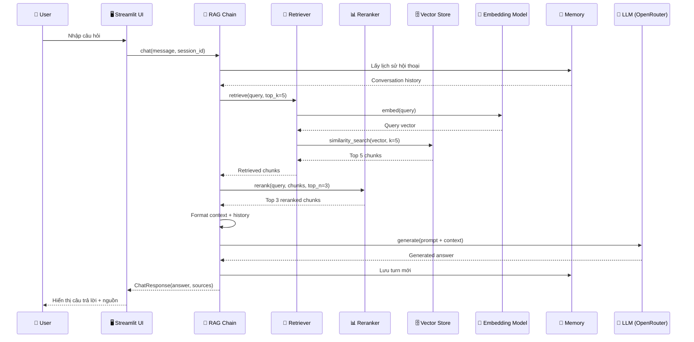
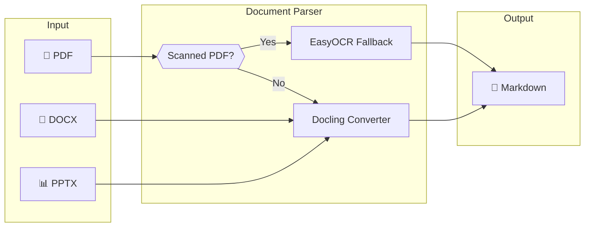
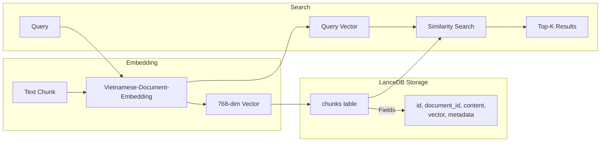
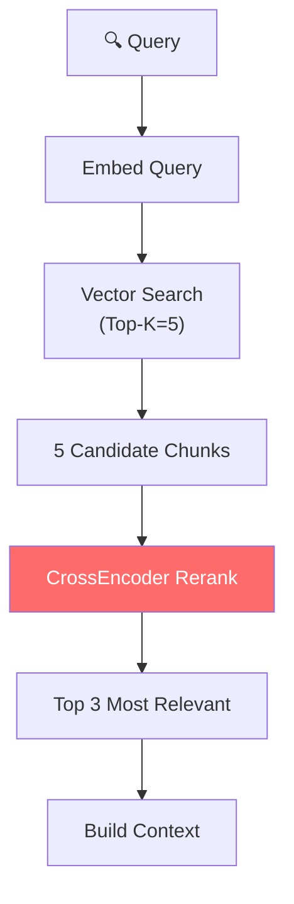
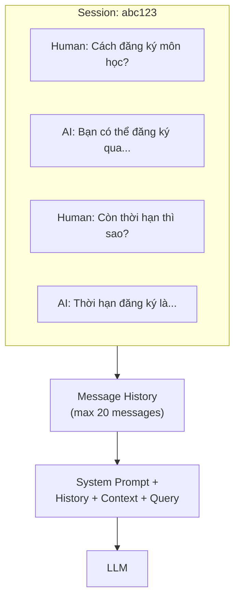
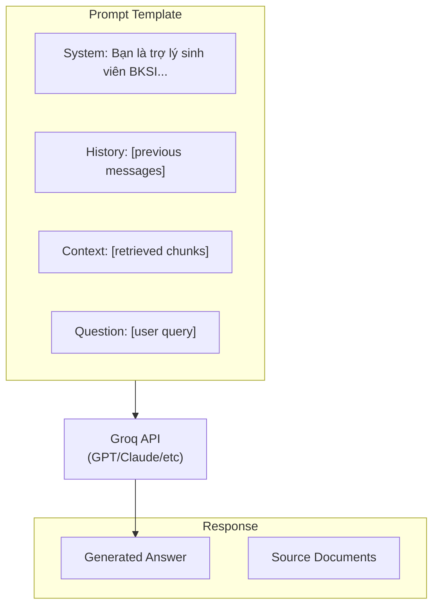

# 🎓 Chatbot BKSI

**RAG-based Q&A Chatbot** cho sinh viên Trường Đại Học Bách Khoa - ĐHQG-HCM.

Hệ thống sử dụng kỹ thuật **Retrieval-Augmented Generation (RAG)** để trả lời câu hỏi dựa trên tài liệu nội quy, quy chế và hướng dẫn của trường.

---

## 📋 Mục lục

- [Tính năng](#-tính-năng)
- [Kiến trúc hệ thống](#-kiến-trúc-hệ-thống)
- [Công nghệ sử dụng](#-công-nghệ-sử-dụng)
- [Chi tiết kỹ thuật](#-chi-tiết-kỹ-thuật)
- [Cấu trúc dự án](#-cấu-trúc-dự-án)
- [Cài đặt](#-cài-đặt)
- [Sử dụng](#-sử-dụng)
- [Cấu hình](#-cấu-hình)

---

## ✨ Tính năng

| Tính năng                    | Mô tả                                                                 |
| ---------------------------- | --------------------------------------------------------------------- |
| 📄 **Document Processing**   | Parse PDF, DOCX, PPTX với Docling + OCR fallback                      |
| 🇻🇳 **Vietnamese Embeddings** | Tối ưu cho tiếng Việt với `dangvantuan/vietnamese-document-embedding` |
| 🗄️ **LanceDB Vector Store**  | Serverless, cross-platform vector database                            |
| ⚡ **Response Caching**      | Cache câu trả lời để tăng tốc truy vấn lặp lại                        |
| 💬 **Conversation Memory**   | Duy trì ngữ cảnh hội thoại đa lượt                                    |
| 🎯 **Reranking**             | Cải thiện độ chính xác với CrossEncoder                               |
| 🖥️ **Streamlit UI**          | Giao diện chat hiện đại, responsive                                   |

---

## 🏗️ Kiến trúc hệ thống

### Tổng quan RAG Pipeline



### Luồng xử lý chi tiết



---

## 🛠️ Công nghệ sử dụng

| Thành phần          | Công nghệ                                      | Mô tả                                |
| ------------------- | ---------------------------------------------- | ------------------------------------ |
| **Package Manager** | [uv](https://github.com/astral-sh/uv)          | Package manager nhanh cho Python     |
| **Vector Database** | [LanceDB](https://lancedb.com/)                | Serverless, embedded vector database |
| **LLM Framework**   | [LangChain](https://langchain.com/)            | Framework cho ứng dụng LLM           |
| **LLM Provider**    | [GroqCloud](https://groq.com)           | API gateway cho nhiều LLM models     |
| **Document Parser** | [Docling](https://github.com/DS4SD/docling)    | Parse PDF, DOCX, PPTX thành Markdown |
| **OCR**             | [EasyOCR](https://github.com/JaidedAI/EasyOCR) | OCR cho PDF scan (hỗ trợ tiếng Việt) |
| **Embeddings**      | [sentence-transformers](https://sbert.net/)    | Vietnamese document embedding model  |
| **Reranking**       | CrossEncoder                                   | ms-marco-MiniLM-L-6-v2 cho reranking |
| **Caching**         | LangChain SQLiteCache                          | Cache response để tối ưu             |
| **UI**              | [Streamlit](https://streamlit.io/)             | Web UI framework                     |

---

## 🔧 Chi tiết kỹ thuật

### 1. Document Processing



**Chi tiết:**

- **Docling**: Parse native text từ PDF, DOCX, PPTX
- **Scanned PDF Detection**: Kiểm tra nếu PDF là ảnh scan (không có text layer)
- **EasyOCR Fallback**: OCR với hỗ trợ tiếng Việt cho scanned PDF
- **Output**: Markdown format để giữ cấu trúc document

### 2. Text Chunking

```
┌─────────────────────────────────────────────────────────┐
│                    Original Document                    │
└─────────────────────────────────────────────────────────┘
                            │
                            ▼
┌────────────────┐ ┌────────────────┐ ┌────────────────┐
│   Chunk 1      │ │   Chunk 2      │ │   Chunk 3      │
│  (512 tokens)  │ │  (512 tokens)  │ │  (512 tokens)  │
└────────────────┘ └────────────────┘ └────────────────┘
         │                  │                  │
         └──────┬───────────┴──────────┬───────┘
                │     50 token overlap │
                ▼                      ▼
```

**Tham số:**

- `chunk_size`: 512 tokens
- `chunk_overlap`: 50 tokens (để giữ ngữ cảnh giữa các chunks)
- **Splitter**: RecursiveCharacterTextSplitter

### 3. Embedding & Vector Store



**Embedding Model:**

- **Model**: `dangvantuan/vietnamese-document-embedding`
- **Dimension**: 768
- **Optimized**: Cho tiếng Việt

### 4. Retrieval & Reranking



**Two-stage Retrieval:**

1. **Stage 1 - Vector Search**: Tìm top-K chunks bằng cosine similarity
2. **Stage 2 - Reranking**: CrossEncoder đánh giá lại relevance và chọn top-N

### 5. Conversation Memory



**Chi tiết:**

- **In-memory storage**: Lưu theo session_id
- **Max messages**: 20 (có thể cấu hình)
- **Format**: HumanMessage / AIMessage pairs

### 6. LLM Generation



---

## 📁 Cấu trúc dự án

```
Chatbot_BKSI/
├── configs/                    # Cấu hình
│   ├── settings.yaml          # Cài đặt ứng dụng
│   └── prompts.yaml           # Prompt templates
├── data/                       # Dữ liệu
│   ├── raw/                   # Tài liệu gốc (PDF, DOCX)
│   └── processed/             # Markdown đã xử lý
├── lancedb_data/              # Vector database
├── scripts/                    # CLI scripts
│   └── cli.py                 # Typer CLI commands
├── src/                        # Source code chính
│   ├── cache/                 # Response caching
│   ├── config.py              # Settings management
│   ├── document_processing/   # Parser & Chunker
│   │   ├── parser.py         # Docling + OCR parser
│   │   └── chunker.py        # Text splitter
│   ├── embeddings/            # Embedding model
│   │   └── embedder.py       # sentence-transformers wrapper
│   ├── models/                # Pydantic models
│   ├── rag/                   # RAG components
│   │   ├── chain.py          # Main RAG chain
│   │   ├── retriever.py      # Vector retriever
│   │   ├── reranker.py       # CrossEncoder reranker
│   │   └── memory.py         # Conversation memory
│   ├── utils/                 # Logging, helpers
│   └── vectorstore/           # LanceDB wrapper
│       └── lancedb_store.py
├── ui/                         # User Interface
│   ├── streamlit_app.py       # Streamlit application
│   ├── style.css              # Custom CSS
│   └── hero.js                # Hero mode JavaScript
├── .env.example               # Environment template
├── pyproject.toml             # Project config
└── README.md
```

---

## 🚀 Cài đặt

### Yêu cầu

- Python 3.10+
- [uv](https://github.com/astral-sh/uv) package manager

### Bước cài đặt

```bash
# Clone repository
git clone <repository-url>
cd Chatbot_BKSI

# Cài đặt dependencies
uv sync

# Copy file cấu hình
cp .env.example .env

# Chỉnh sửa .env với API key của bạn
# OPENROUTER_API_KEY=your_key_here
```

---

## 📖 Sử dụng

### 1. Ingest tài liệu

Đặt file PDF, DOCX vào `data/raw/`:

```bash
# Ingest tài liệu mới
uv run bksi ingest

# Rebuild toàn bộ index
uv run bksi ingest --rebuild
```

### 2. Chạy Streamlit UI

```bash
uv run bksi streamlit
```

Truy cập `http://localhost:8501`

### 3. Chat trong Terminal

```bash
uv run bksi chat
```

### 4. Xóa cache

```bash
uv run bksi clear-cache
```

---

## ⚙️ Cấu hình

### Environment Variables (`.env`)

```bash
# Bắt buộc
OPENROUTER_API_KEY=your_openrouter_api_key

# Tùy chọn
LLM_MODEL=openai/gpt-4o-mini
EMBEDDING_MODEL=dangvantuan/vietnamese-document-embedding
EMBEDDING_DEVICE=cpu  # hoặc cuda
```

### Settings (`configs/settings.yaml`)

```yaml
llm:
  model: openai/gpt-4o-mini
  temperature: 0.7
  max_tokens: 2048

embeddings:
  model: dangvantuan/vietnamese-document-embedding
  device: cuda # hoặc cpu

vectorstore:
  persist_dir: ./lancedb_data
  table_name: chunks

rag:
  top_k: 5 # Số chunks retrieve
  chunk_size: 512 # Kích thước chunk
  chunk_overlap: 50 # Overlap giữa chunks
  rerank_enabled: true
  rerank_model: ms-marco-MiniLM-L-6-v2
  rerank_top_n: 3 # Số chunks sau rerank

cache:
  enabled: true
  directory: ./.cache

memory:
  enabled: true
  max_messages: 20
```
